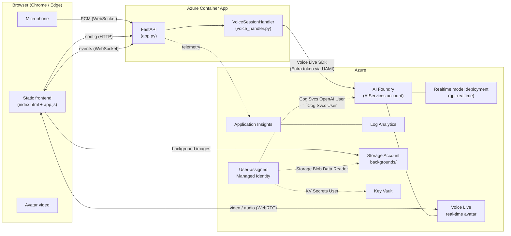

# Architecture

## Request flow

1. **Page load** — `GET /api/config` returns deployed defaults; the frontend overlays any `localStorage` overrides.
2. **Start session** — frontend opens a WebSocket to `/ws/{client_id}` with the merged config.
3. **Backend** uses the user-assigned Managed Identity (`AZURE_CLIENT_ID` env var) to acquire an Entra token for `https://cognitiveservices.azure.com/`.
4. **Voice Live SDK** (`azure-ai-voicelive`) opens its own WebSocket to the AI Foundry endpoint and starts a realtime session against the configured model + avatar.
5. **Audio in** — browser mic → WebSocket → backend → Voice Live SDK.
6. **Avatar video** — Voice Live → WebRTC peer connection → browser `<video>` (the backend only relays the SDP exchange).
7. **Telemetry** — `APPLICATIONINSIGHTS_CONNECTION_STRING` is set on the Container App; standard ASP.NET / FastAPI logs flow into Log Analytics.

## Why this shape

- **One Container App, no orchestration:** keeps the Bicep small enough for a one-click experience and keeps the demo cheap to leave running on `min-replicas=0`.
- **Managed Identity, not keys:** all auth to Foundry / Storage / KV is via the UAMI — no secrets in env vars, no rotation burden.
- **Static frontend served by FastAPI:** no separate CDN / Static Web App / build pipeline. Frontend lives in `app/static/` and is mounted at `/`.
- **WebRTC for avatar video, WebSocket for control:** mirrors how Microsoft's first-party Voice Live samples are built.

## What is NOT here (deferred)

- AAD-protected admin endpoint (current model is single-tenant per deployment, no separate admin auth).
- Multi-tenant config persistence (each browser is its own session).
- Programmatic `POST /api/config` (planned for v1.1 — see plan).
- Foundry Agent mode wiring (the upstream sample supports it; we ship Model mode in v1).
